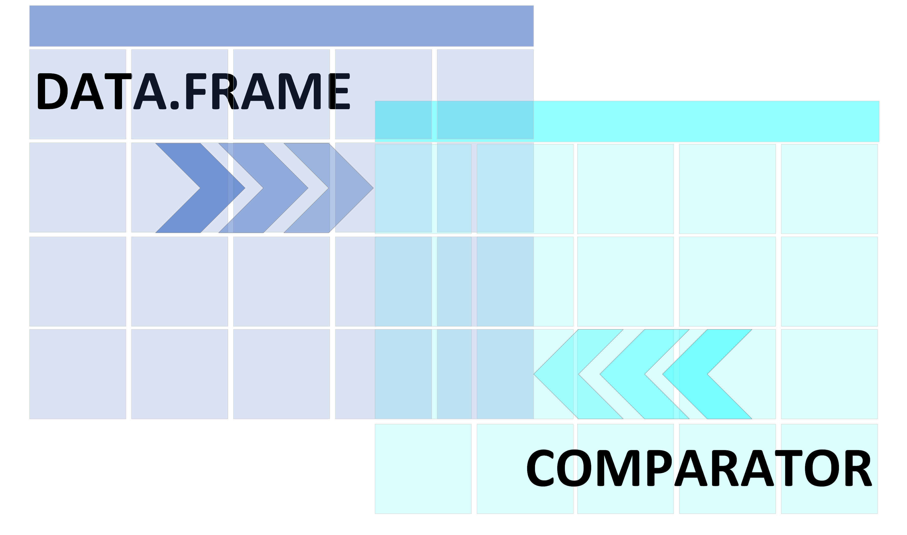

# Presentation
A shiny app used to check values differencies between two dataframe. This app have three main tabs :  

# Load data section

This tab allows user to load data and run the comparison of loaded data.
INPUTS : Upload inputs help to load data in the app. The extensions accepted here are :
.csv, .tsv and .rds
After the user load the data, he can heat on '>COMPARE' button to run the comparison.
The value box bellow the input box will shows the percentage of difference and will be colored acording to the value.
OUTPUTS : A high level description of data loaded through the uploader. Here, user may find :
variables names, variables types, the complete rate, the distribution or the number of unique values.  

# Comparison description
This tab allows user to read the first results of the comparison.
OUTPUTS : several tables are diplayed here :
-> table of input data dimension, which shows the number of rows and columns of data to compare  
-> table of comparison summary, which shows values of comparison indicator  
-> table of number of difference by variable, which shows the number of difference by variables in data  
-> table of variables not compared, which shows the variables of each input data which are not compare to others.  

# Details on difference
This tab allows user to read the differences between input data cell by cell.
OUTPUTS : several tables are diplayed here :
-> table of attributs, which shows non identical attributs between the two data  
-> table of not shared variables, which shows variables in X but not in Y and present in Y but not in X  
-> table of not shared observations, which shows the observations not shared between the two data  
-> table of detected diferences, which shows all the diferences in the data row by row.   