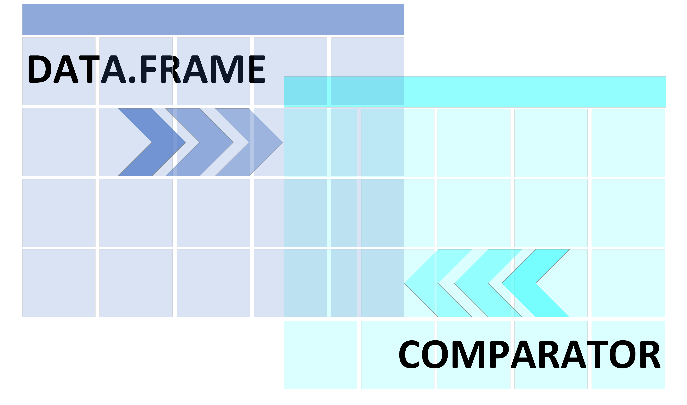

dataCompare
================
Sergio, Ewane Ebouele
2024-11-13 22:33:03 EST

<!-- badges: start -->

<!-- badges: end -->

# Package vignette

[access the vignette here.](https://cran.r-project.org/web/packages/dataCompare/vignettes/dataCompare.html)

# Presentation

A shiny app used to check values differencies between two dataframe.
This app has four main tabs :  

# Load data section

This tab allows user to load data and run the comparison of loaded
data.  
INPUTS : Upload inputs help to load data in the app. The extensions
accepted here are : .csv, .tsv and .rds  
After the user load the data, he can heat on ‘\>COMPARE’ button to run
the comparison. The value box bellow the input box will shows the
percentage of difference and will be colored according to the value.  
OUTPUTS : A high level description of data loaded through the uploader.
Here, user may find : variables names, variables types, the complete
rate, the distribution or the number of unique values.

# Comparison description

This tab allows user to read the first results of the comparison.  
OUTPUTS : several tables are displayed here :  
-\> table of input data dimension, which shows the number of rows and
columns of data to compare  
-\> table of comparison summary, which shows values of comparison
indicator  
-\> table of number of difference by variable, which shows the number of
difference by variables in data  
-\> table of variables not compared, which shows the variables of each
input data which are not compare to others.

# Details on difference

This tab allows user to read the differences between input data cell by
cell.  
OUTPUTS : several tables are displayed here :  
-\> table of attributes, which shows non identical attributes between
the two data  
-\> table of not shared variables, which shows variables in X but not in
Y and present in Y but not in X  
-\> table of not shared observations, which shows the observations not
shared between the two data  
-\> table of detected differences, which shows all the differences in
the data row by row.

# Comparison report

This tab allows the user to compile the html report and download it in
his local storage. INPUT : Several fields are shown here: -\> Title of
the report : User need to provide a title to the report. -\> Author name
: user need to provide his name here -\> Report context : User need to
provide a small paragraph which describes the context or purpose of the
report OUTPUTS : After clicking on ‘RUN’ button, the html report will
appear at the middle of the boby and a ‘SAVE’ button will appear to
download the report. NOTE : This report is interactive. user can updates
it by entering new values and clicks on ‘RUN’.
