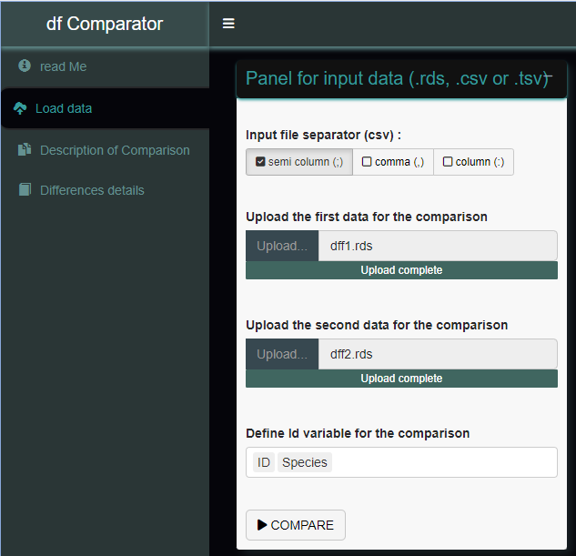
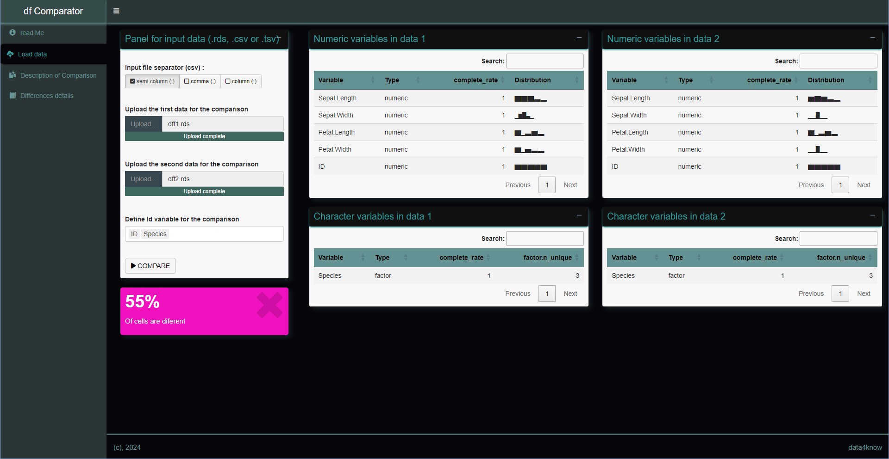

```{r , echo=FALSE, out.width="40%", fig.align='center'}
knitr::include_graphics("../inst/app/www/dfComparator_vignette.png")
```


# Overview

Data scientists have always used data to gain insight. They develop models to explain or predict an output variable with input characteristics.  
Sometimes they develop pipelines to complete an end-to-end process. Going from raw data to final prediction or scoring involves many steps:  

  
  1- Data loading  
  2- Data pre-processing or transformation  
  3- Model training   
  4- Model prediction  
  5- Post model prediction logic : prediction aggregation, indicator calculation and segmentation  
  
Each of these steps generates data, referred to here as 'intermediate results' or 'final output'.  

In most cases, machine learning models are standalone objects that are shared with other applications via an API.  
To make sure that the deployed API pipeline looks exactly like the modeler's pipeline, we need to compare their outputs.  
**`Data For Know (D4K)`** provides a graphical tool to compare the two pipelines.  
**`dataCompare`** is a tool for comparing the outputs of two machine learning pipelines. It helps to check if the pipelines are similar or not.  

```{r , echo=FALSE, out.width="98%", fig.align='center'}
knitr::include_graphics("../inst/app/www/context.png")
```


```{r, include = FALSE}
knitr::opts_chunk$set(
  collapse = TRUE,
  comment = "#>"
)
```


# Presentation

**`dataCompare`** is a shiny application developed with the Golem framework. It is used to check value differences between two dataframes. The code below shows how to install it from Github and CRAN. 

## Install and Load


```{r setup, eval=FALSE}
# From Cran
install.packages('dataCompare')

# From Github
install_github('seewe/dataCompare')

# Load in the environment
library(dataCompare)
```


## Run the app with the following code

```{r eval=FALSE}
dataCompare::run_data_compare_app()
```


```{r , echo=FALSE, out.width="98%", fig.align='center'}
knitr::include_graphics("../inst/app/www/mainPage.PNG")
```
  
  
# App description

The `dataCompare` application has three tabs for viewing:  
  - Load data  
  - Description of Comparison  
  - Differences details  

## Load data  

This tab allows the user to load data and compare the loaded data.  

**INPUTS** : Upload inputs help to load data into the application. The extensions accepted here are: .csv, .tsv and .rds.  
For .csv files, be sure to specify the correct separator `(';', ',', ':')`.  
  
Once the user has loaded the data, he can press the **`>COMPARE`** button to perform the comparison.
The value box below the input box will show the percentage of difference and will be coloured according to the value. 

```{r , echo=FALSE, out.width="70%", fig.align='center'}

```


**OUTPUTS** : A high-level description of the data loaded by the uploader. Here the user can find : variable names, variable types, variable completion rate, distribution or number of unique values. 
  
  

```{r , echo=FALSE, out.width="98%", fig.align='center'}

```


## Description of Comparison  

This tab allows the user to read the first results of the comparison.  
**OUTPUTS** : several tables are displayed here:  
-> Input data dimension table, which shows the number of rows and columns of data to be compared  
-> Comparison summary table, showing the values of the comparison indicator  
-> Table of number of differences by variable, which shows the number of differences by variable in the data  
-> Table of variables not compared, which shows the variables of each input data that are not compared with others.  
  

```{r , echo=FALSE, out.width="98%", fig.align='center'}
knitr::include_graphics("../inst/app/www/comparisonDescription.PNG")
```

## Differences details  

This tab allows the user to read the differences between the input data, cell by cell.  
**OUTPUTS** : Several tables are displayed here:  
-> Attributes table, which shows non-identical attributes between the two data sets  
-> Table of not shared variables, showing variables in X but not in Y and variables present in Y but not in X.  
-> Table of not shared observations, which shows the observations that are not shared between the two data.  
-> Table of detected differences, showing all the differences in the data, row by row.   
  

```{r , echo=FALSE, out.width="98%", fig.align='center'}
knitr::include_graphics("../inst/app/www/detailsDifferences.PNG")
```

