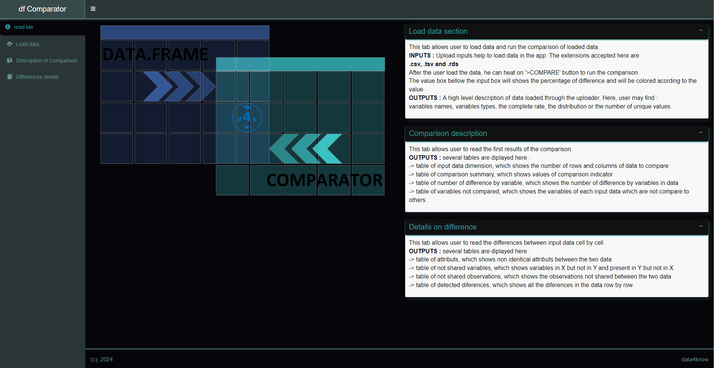
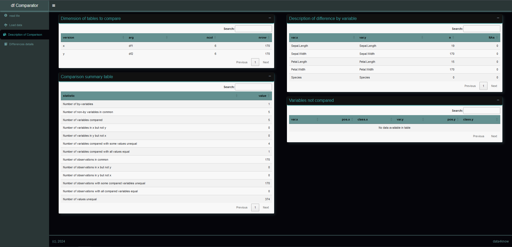
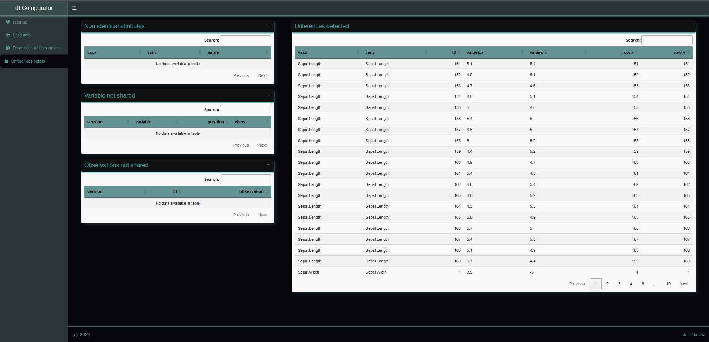

```{r setup, echo=FALSE, warning=FALSE, message=FALSE}
library(dplyr)
```


```{r , echo=FALSE, out.width="35%", fig.align='left'}
knitr::include_graphics("../inst/app/www/dfComparator_vignette.png")
```


# Overview

Data scientists have always used data to gain insight. They develop models to explain or predict an output variable with input characteristics.  
Sometimes they develop pipelines to complete an end-to-end process. Going from raw data to final prediction or scoring involves many steps:  

  
  1- Data loading  
  2- Data pre-processing or transformation  
  3- Model training   
  4- Model prediction  
  5- Post model prediction logic : prediction aggregation, indicator calculation and segmentation  
  
Each of these steps generates data, referred to here as 'intermediate results' or 'final output'.  

In most cases, machine learning models are standalone objects that are shared with other applications via an API.  
To make sure that the deployed API pipeline looks exactly like the modeler's pipeline, we need to compare their outputs.  
**`Data For Know (D4K)`** provides a graphical tool to compare the two pipelines.  
**`dataCompare`** is a tool for comparing the outputs of two machine learning pipelines. It helps to check if the pipelines are similar or not.  

```{r , echo=FALSE, out.width="98%", fig.align='center'}
knitr::include_graphics("../inst/app/www/context.png")
```


```{r, include = FALSE}
knitr::opts_chunk$set(
  collapse = TRUE,
  comment = "#>"
)
```


# Presentation

**`dataCompare`** is a shiny application developed with the Golem framework. It is used to check value differences between two dataframes. The code below shows how to install it from Github and CRAN. 

## Install and Load


```{r eval=FALSE}
# From Cran
install.packages('dataCompare')

# From Github
install_github('seewe/dataCompare')

# Load in the environment
library(dataCompare)
```


## Run the app with the following code

```{r eval=FALSE}
dataCompare::run_data_compare_app()
```


```{r , echo=FALSE, out.width="98%", fig.align='center'}

```
  
  
# Shiny App description

The `dataCompare` application has three tabs for viewing:  
  - Load data  
  - Description of Comparison  
  - Differences details  

## Load data  

This tab allows the user to load data and compare the loaded data.  

**INPUTS** : Upload inputs help to load data into the application. The extensions accepted here are: .csv, .tsv and .rds.  
For .csv files, be sure to specify the correct separator `(';', ',', ':')`.  
  
Once the user has loaded the data, he can press the **`>COMPARE`** button to perform the comparison.
The value box below the input box will show the percentage of difference and will be coloured according to the value. 

```{r , echo=FALSE, out.width="70%", fig.align='center'}
knitr::include_graphics("../inst/app/www/dataLoader.PNG")
```


**OUTPUTS** : A high-level description of the data loaded by the uploader. Here the user can find : variable names, variable types, variable completion rate, distribution or number of unique values. 
  
  

```{r , echo=FALSE, out.width="98%", fig.align='center'}
knitr::include_graphics("../inst/app/www/afterClickCompare.PNG")
```


## Description of Comparison  

This tab allows the user to read the first results of the comparison.  
**OUTPUTS** : several tables are displayed here:  
-> Input data dimension table, which shows the number of rows and columns of data to be compared  
-> Comparison summary table, showing the values of the comparison indicator  
-> Table of number of differences by variable, which shows the number of differences by variable in the data  
-> Table of variables not compared, which shows the variables of each input data that are not compared with others.  
  

```{r , echo=FALSE, out.width="98%", fig.align='center'}

```

## Differences details  

This tab allows the user to read the differences between the input data, cell by cell.  
**OUTPUTS** : Several tables are displayed here:  
-> Attributes table, which shows non-identical attributes between the two data sets  
-> Table of not shared variables, showing variables in X but not in Y and variables present in Y but not in X.  
-> Table of not shared observations, which shows the observations that are not shared between the two data.  
-> Table of detected differences, showing all the differences in the data, row by row.   
  

```{r , echo=FALSE, out.width="98%", fig.align='center'}

```


## Comparison report

This tab allows the user to compile the html report and download it in his local storage.
**INPUT** : Several fields are shown here:
-> Title of the report : User need to provide a title to the report.
-> Author name : user need to provide his name here
-> Report context : User need to provide a small paragraph which describe the context or purpose of the report
**OUTPUTS** : After clicking on 'RUN' button, the html report will appear at the middle of the boby and a 'SAVE' button will appear to download the report.
**NOTE** : This report is interactive. user can update it by entering new values and click on 'RUN'. 


```{r , echo=FALSE, out.width="98%", fig.align='center'}

```


# Inline code description

Beyond the shiny app, users can run some function of `dataCompare` to perform certain tasks.  
Let us define two dataframe from the `iris` dataframe.

## Sample dataframe

```{r}
iris_1 <- iris %>% dplyr::mutate(
  var_add1 = sample.int(nrow(iris), replace = TRUE),
  var_add2 = rnorm(nrow(iris)),
  var_add3 = sample(c("cat1", "cat2", "cat3"), nrow(iris), replace = TRUE)
)
iris_1 <- iris_1 %>% 
  rbind.data.frame(
    iris_1 %>% dplyr::sample_n(50)
  ) %>% 
  dplyr::mutate(
    ID = row_number()
  )

iris_2 <- iris %>% dplyr::mutate(
  var_more = sample(c("cat1", "cat2", "cat3"), nrow(iris), replace = TRUE),
  var_add3 = sample.int(nrow(iris), replace = TRUE)
)
iris_2 <- iris_2  %>% rbind.data.frame(
    iris_2 %>% dplyr::sample_n(50)
  ) %>% 
  dplyr::mutate(
    ID = row_number()
  )
```


## Run the comparison report and build an html report

```{r eval=FALSE}
dataCompare::compare_data_frame_object_report(
      df1 = iris_1,
      df2 = iris_2,
      ids = "ID",
      report_title = "Iris data comparison",
      report_author = "Sergio Ewane",
      report_context = "This report aim to show an example of how to perform a comparison and build an html report."
    )
```


## Format a dataframe

```{r}
dataCompare::data_table_formatter(iris)
```

## List same variables in two dataframe

This function returns all variable with the same name and type in two dataframe. The example bellow doesn't shows `var_add3` in the list because it's character in iris_1 and integer in iris_2.

```{r}
dataCompare::same_variables(iris_1, iris_2)
```


## Describe character variables in a dataframe

This function use the `skim` function in `skimr` package.

```{r}
dataCompare::skim_char(iris_1) %>% dataCompare::data_table_formatter(.)
```


## Describe numeric variables in a dataframe

This function use the `skim` function in `skimr` package.

```{r}
dataCompare::skim_num(iris_1) %>% dataCompare::data_table_formatter(.)
```


## Compare two dataframe cells values {.tabset}


```{r}
comparison <- dataCompare::compare_data_frame_object(iris_1, iris_2, "ID")
```

The outputs of the comparison are listed here :  

### result 1 : difference percentage

```{r echo=FALSE}
 comparison$diff_percentage
```

### result 2 : frame summary table

```{r echo=FALSE}
dataCompare::data_table_formatter( comparison$frame.summary.table )
```

### result 3 : attributs table

```{r echo=FALSE}
dataCompare::data_table_formatter( comparison$attrs.table )
```

### result 4 : comparison summary table

```{r echo=FALSE}
dataCompare::data_table_formatter( comparison$comparison.summary.table )
```

### result 5 : variables not shared table

```{r echo=FALSE}
dataCompare::data_table_formatter( comparison$vars.ns.table )
```

### result 6 : variables not compared table

```{r echo=FALSE}
dataCompare::data_table_formatter( comparison$vars.nc.table )
```

### result 7 : observations table

```{r echo=FALSE}
dataCompare::data_table_formatter( comparison$obs.table )
```

### result 8 : differences by variables table

```{r echo=FALSE}
dataCompare::data_table_formatter( comparison$diffs.byvar.table )
```

### result 9 : differences by observation table

```{r echo=FALSE}
dataCompare::data_table_formatter( comparison$diffs.table )
```

